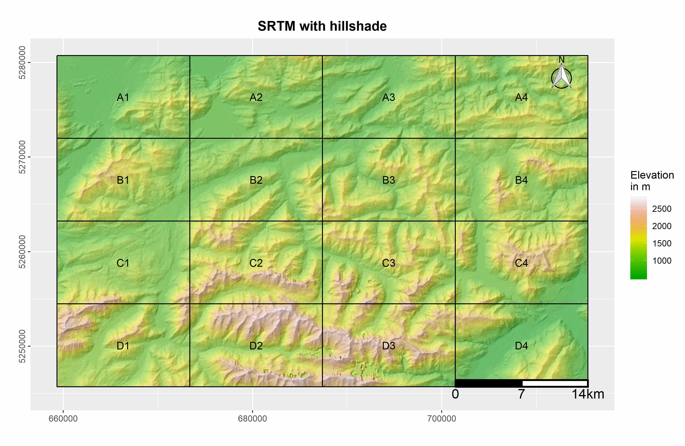
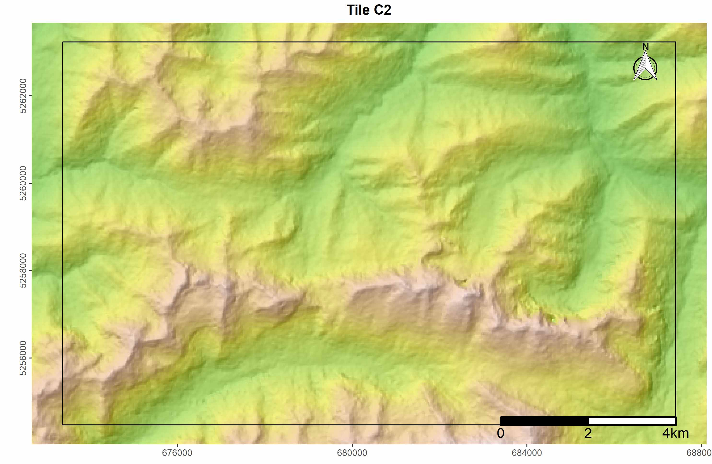

# MapBooklet
R package for generating map booklets.

## Installation

To install the current version, use `devtools`.

```R
devtools::install_github("MBalthasar/MapBooklet")
```

## Available Functions

The following functions are currently available and tested on Windows 10.

* `FishnetFunction()` This function creates a fishnet polygon from an input shapefile. The output fishnet will be reprojected to UTM.
* `BookletMaker()` This function uses a fishnet polygon to create a map booklet pdf based on a user ggplot. The booklet contains an overview map with the original ggplot and the fishnet polygon added on top, as well as sub-maps for each tile of the fishnet polygon.

## Example

```R
library(sp)
library(raster)
library(ggplot2)
library(ggsn)
library(geosphere)
library(RStoolbox)
library(pdftools)
library(magick)

# Load sample srtm and hillshade
my_srtm <- raster::brick(system.file(package = "MapBooklet",
                                     "extdata", "srtm_sample.tif"))
my_hill <- raster::brick(system.file(package = "MapBooklet",
                                     "extdata", "hillshade_sample.tif"))

# Use ggR to plot raster files
my_plot <- ggR(my_hill, # Add hillshade
               # maxpixels = my_hill@ncols*my_hill@nrows # Use full resolution
) +
  ggtitle("SRTM with hillshade") + # Add title
  ggR(my_srtm, geom_raster = TRUE, ggLayer = TRUE, alpha = 0.5, # Add srtm with alpha = 0.5
      # maxpixels = my_srtm@ncols*my_srtm@nrows # Use full resolution
  ) +
  scale_fill_gradientn(colours = terrain.colors(100), # Choose colors for srtm
                       name = "Elevation\nin m") + # Choose name for legend
  theme(plot.title = element_text(hjust = 0.5, face="bold", size=14), # Adjust title
        axis.text.y = element_text(angle = 90, hjust = 0.5)) + # Vertical y axis labels
  xlab("") + # Remove x lab
  ylab("") # Remove y lab

# Plot map
my_plot

# Create fishnet polygon from raster extent
my_extent <- methods::as(raster::extent(my_srtm), 'SpatialPolygons')
proj4string(my_extent) <- sp::CRS(as.character(raster::crs(my_srtm)))
my_fishnet <- FishnetFunction(my_poly = my_extent, extent_only = TRUE, diff_factor = 4)

# Execute with all parameters defined.
# In orer to have a landscape DinA4 format, multiply the width by 1.414286.
my_booklet <- BookletMaker(user_ggplot = my_plot,
                           user_fishnet = my_fishnet,
                           fishnet_col = "black",
                           user_width  = 7 * 1.414286,
                           user_height = 7,
                           user_pointsize = NULL,
                           out_dir = "./",
                           user_buffer = 0,
                           add_scale = TRUE,
                           add_north = TRUE)
```

This results in a map booklet with an overview map...



... and 16 tiles such as this one:


